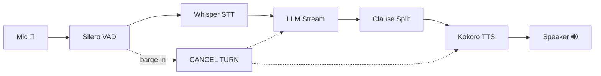

# 👋 Hey there — Professor Willy here.

<p align="center">
  
</p>

<p align="center">
  <a href="https://github.com/Hot-Coco/Skadoosh"></a>
  <a href="https://www.npmjs.com/package/beaned-charts"></a>
  <a href="https://github.com/Hot-Coco"></a>
</p>

---

## 🧪 What I'm Building

<table>
<tr>
<td width="50%">

### ⚡ [Skadoosh](https://github.com/Hot-Coco/Skadoosh)
*A modular, lightning-fast local voice agent framework in Rust*



> **Sub-150ms** from end-of-speech to first audio. `#![forbid(unsafe_code)]`.  
> Published on [crates.io](https://crates.io/crates/skadoosh) · MIT OR Apache-2.0

</td>
<td width="50%">

### 📊 [beaned-charts](https://github.com/Hot-Coco/beaned-charts)
*Beautiful SVG chart library — Bar, Line, Pie & Donut*

```javascript
const { BarChart, LineChart, PieChart } = require('beaned-charts');

const chart = new PieChart(data, {
  theme: 'dark',
  holeSize: 0.3,       // donut style
  explodeSlices: true,
  hoverEffects: true
});

document.body.innerHTML += chart.render();
```

> **8 ⭐** on GitHub · Published on [npm](https://www.npmjs.com/package/beaned-charts) as `beaned-charts@3.3.2`  
> Pure SVG · Dark/Light themes · React components · Always-visible tooltips

</td>
</tr>
</table>

---

## 🗂️ All Projects

| Project | Stack | Stars | What it does |
|---------|-------|-------|-------------|
| **[Skadoosh](https://github.com/Hot-Coco/Skadoosh)** | `Rust` `ONNX` `Whisper` `Ollama` | ⭐ 1 | Voice agent pipeline: VAD → STT → LLM → TTS with barge-in |
| **[beaned-charts](https://github.com/Hot-Coco/beaned-charts)** | `JS` `TS` `SVG` `React` | ⭐ 8 | Beautiful chart library with gradients, animations & tooltips |
| **[YellowRoute](https://github.com/Hot-Coco/YellowRoute)** | `HTML` `CSS` `JS` | ⭐ 1 | Responsive school-bus transportation site for Miami Kids Buses |
| **[stickee](https://github.com/Hot-Coco/stickee)** | `TS` `React` `Tauri` `Supabase` | ⭐ 1 | Desktop sticky-note app with encryption & cloud sync (fork) |

---

## 🧬 Tech DNA

<p align="center">
  
  
  
  
  
  
  
  
  
  
  
  
</p>

---

## 🔥 Activity

<p align="center">
  
  
</p>

<details>
<summary><b>📈 Recent commit pulse</b></summary>
<br>

| When | Repo | What |
|------|------|------|
| Today | **Skadoosh** | `feat: v0.5.0 — 15 cookbook examples` |
| Today | **Skadoosh** | `feat: v0.4.0 — misaki G2P, push-to-talk, echo cancellation, GPU, tools` |
| Today | **Skadoosh** | `llm: tool calling support with SSE delta parsing` |
| Today | **Skadoosh** | `config+llm: multimodal content types + --images flag` |
| Yesterday | **Skadoosh** | `skadoosh v0.2.0: public SDK, pluggable engines, multi-modality CLI` |

> **97 commits** across all repos in 2026 · Skadoosh built from scaffold to v0.5.0 in ~48 hours

</details>

---

## 🎯 Skadoosh by the Numbers

```text
  src/agent.rs        ← public SDK: Agent, AgentBuilder, AgentEvent
  src/audio/          ← cpal ring buffer (lock-free, zero-alloc)
  src/vad/            ← Silero VAD v5 + segmenter state machine
  src/stt/            ← whisper-rs on dedicated thread
  src/llm/            ← SSE streaming client + clause splitter
  src/tts/            ← Kokoro-82M + misaki G2P + MockTts
  src/tools/          ← ToolExecutor for agent tool-calling
  src/pipeline.rs     ← orchestrator: 8 tasks, 9 channels, barge-in
  cookbooks/          ← 15 runnable examples
  tests/              ← 110+ headless tests

  481,639 bytes of Rust    ·    3,579 bytes of Shell
  v0.5.0    ·    CI passing    ·    Dual MIT / Apache-2.0
```

---

## 💻 Custom Code Corner

*A little terminal widget I built — paste this into your browser console for a surprise:*

```javascript
// 🍫 Hot-Coco ASCII Art Generator
((name, emoji) => {
  const styles = [
    'color: #FF6B35; font-size: 20px; font-weight: bold;',
    'color: #4ecdc4; font-size: 16px;',
    'color: #45b7d1; font-size: 16px;',
  ];
  console.log(`
    ██╗  ██╗ ██████╗ ████████╗      ██████╗ ██████╗  ██████╗ ██████╗ 
    ██║  ██║██╔═══██╗╚══██╔══╝     ██╔════╝██╔═══██╗██╔════╝██╔═══██╗
    ███████║██║   ██║   ██║        ██║     ██║   ██║██║     ██║   ██║
    ██╔══██║██║   ██║   ██║        ██║     ██║   ██║██║     ██║   ██║
    ██║  ██║╚██████╔╝   ██║        ╚██████╗╚██████╔╝╚██████╗╚██████╔╝
    ╚═╝  ╚═╝ ╚═════╝    ╚═╝         ╚═════╝ ╚═════╝  ╚═════╝ ╚═════╝
  `, styles[0]);
  console.log(`%c  ${emoji}  Hey there — ${name} here. Good day to y'all! ${emoji}`, styles[1]);
  console.log('%c  Building voice agents, charts, and whatever else seems fun.', styles[2]);
  console.log('%c  github.com/Hot-Coco  ·  crates.io/crates/skadoosh  ·  npm: beaned-charts', styles[2]);
})('Professor Willy', '🧑‍🏫');
```

---

## 🏷️ Gist

<p align="center">
  <a href="https://gist.github.com/Hot-Coco">
    
  </a>
  <em>"A beautiful input box"</em> — because even the small things deserve polish.
</p>

---

<p align="center">
  
</p>

<p align="center">
  <sub>🔭 Currently building at <a href="https://github.com/RappleML">@RappleML</a> · MIT & Apache-2.0 licensed · Open to collaborations</sub>
</p>
